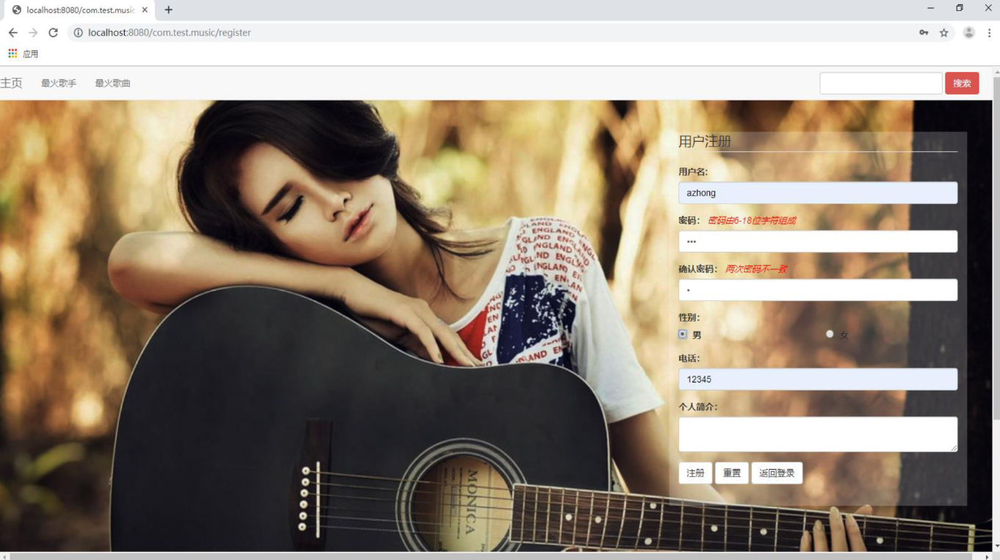
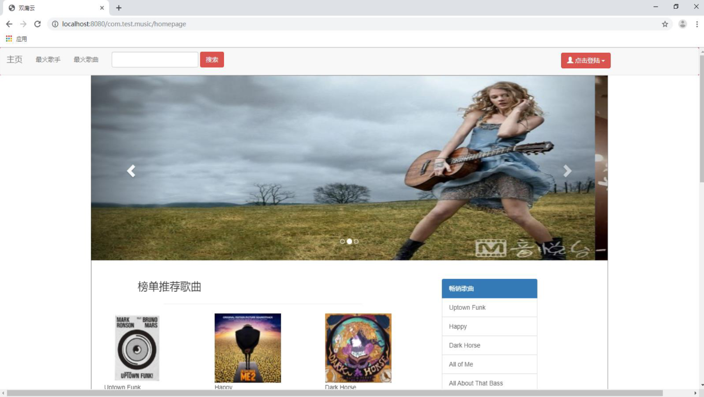
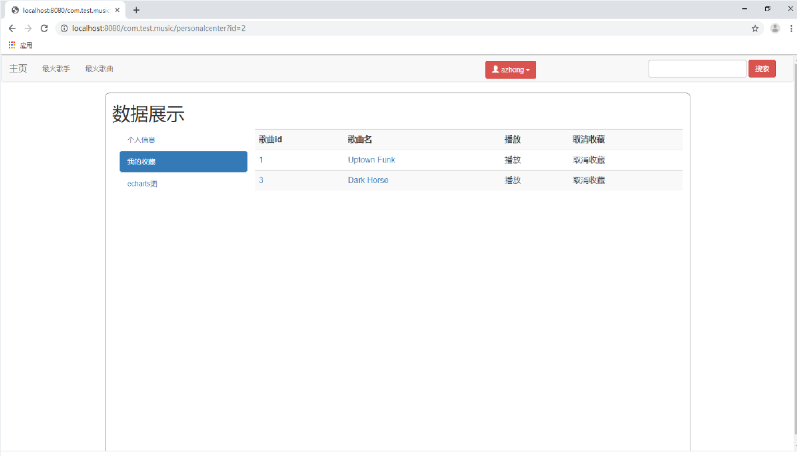
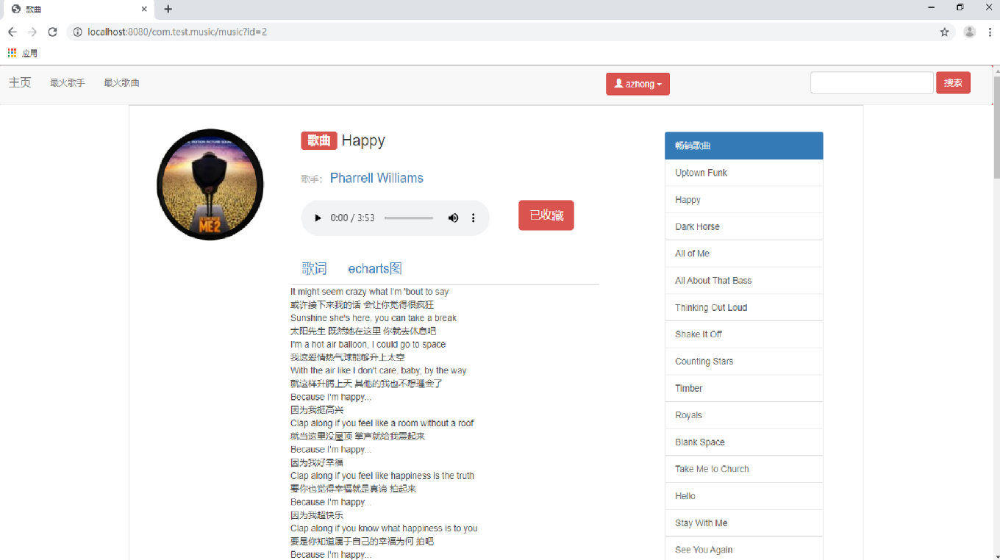
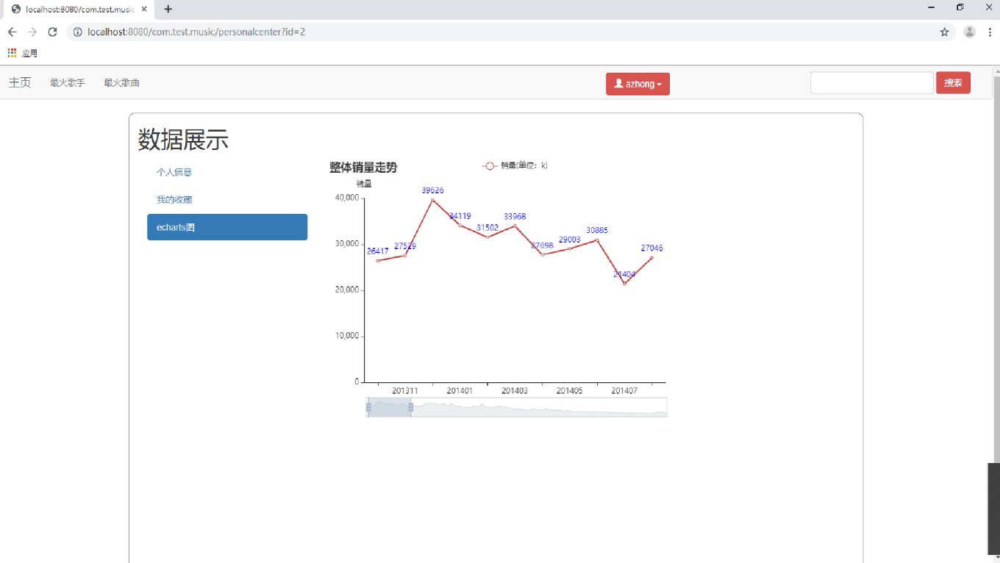

# musical-website-based-based-on-big-data

A musical website based on big data.

• Built a music website using Hibernate and Spring MVC framework in Java.

• Used NetEase Cloud Music API to collect sales data of the top 100 singers and stored data in MySQL.

• Implemented login/logout/sign in, music playing, music lyrics, ranking functions.

• Visualized Apache ECharts of sales data over time using the Hadoop distributed system.

# quick link 

[#Demo](#Demo)

[#Features](#Features)

[#Applications](#Applications)

[#Contect](#Contect)

# Demo presentation 
## Login
 

## Homepage

## Favorite

## Play

## Sales

# Features:
Front-end: Html/CSS/JS

Back-end: Java Spring MVC - Mybatis

Database: MySQL, JDBC

Sales trend: Hadoop, Apache ECharts

# Applications: 
•	Eclipse

•	Postman

•	MySQL

# Contect 

Email:  zzcjob397@gmail.com

Portfolio: https://chriszzhong.georgetown.domains/
